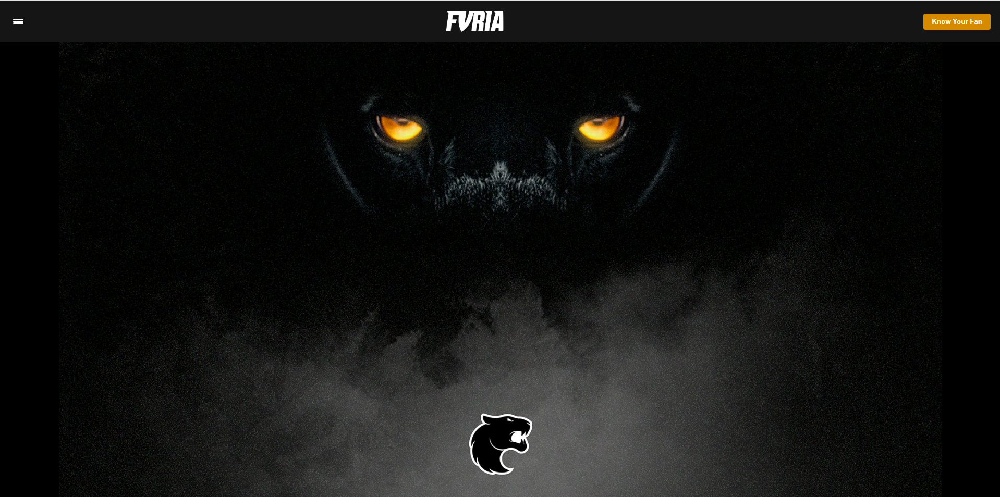
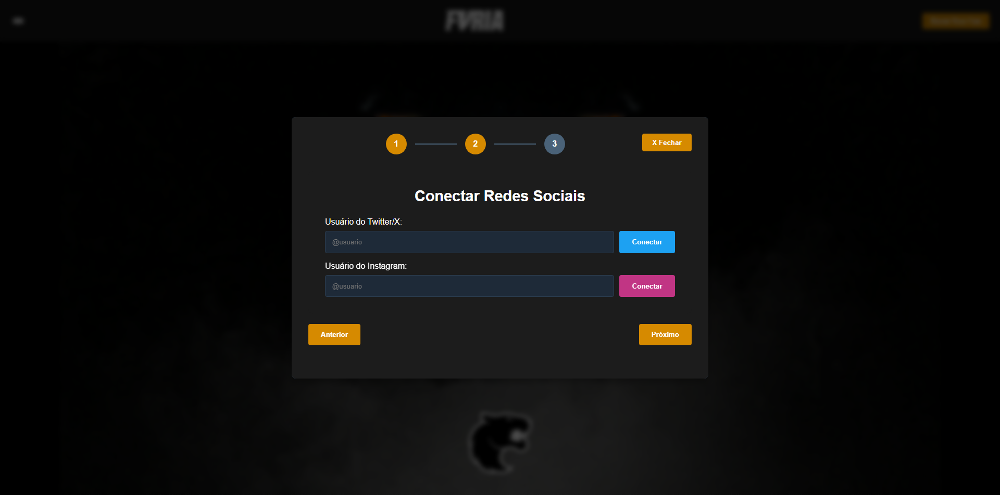
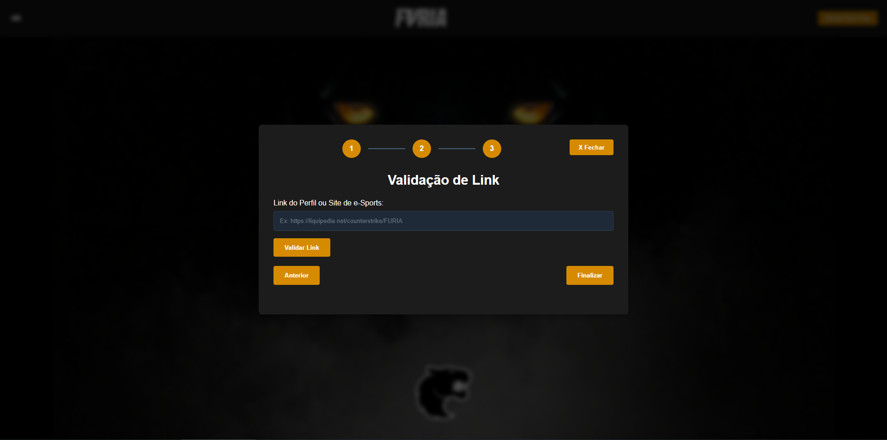

# Furia - Know Your Fan (Front-end)



## 📋 Sobre o Projeto

O E-Sports Fan Profile é uma aplicação React que permite aos usuários de e-Sports validarem sua autenticidade como fãs através da análise de seus perfis em redes sociais, validação de links relacionados a e-Sports e informações pessoais. O objetivo é criar um sistema de verificação e pontuação para fãs genuínos de e-Sports.

## ✨ Funcionalidades

- **Cadastro de Dados Pessoais**: Coleta de informações básicas como nome, CPF e endereço
- **Upload de Documentos**: Verificação de identidade através de documentos oficiais
- **Integração com Redes Sociais**: Análise de perfis do Twitter/X e Instagram para identificar interesses em e-Sports
- **Validação de Links**: Análise de URLs relacionadas a e-Sports para verificar relevância com o perfil do usuário
- **Pontuação de Perfil**: Cálculo de pontuação e classificação do perfil como fã de e-Sports
- **Interface Intuitiva**: Sistema de etapas para guiar o usuário durante todo o processo de validação

## 🛠️ Tecnologias Utilizadas

- **React**: Biblioteca para construção de interfaces
- **TypeScript**: Linguagem de programação tipada
- **Styled-Components**: Estilização dos componentes
- **Fetch API**: Comunicação com o backend

## 🚀 Instalação e Uso

### Requisitos

- Node.js (v14 ou superior)
- NPM ou Yarn

### Passos para Instalação

1. Clone o repositório
```bash
git clone https://github.com/Megiolaro/Furia-Know-Your-Fan.git
cd "Know Your Fan - Frontend"
```

2. Instale as dependências
```bash
npm install
# ou
yarn install
```

3. Inicie o servidor de desenvolvimento
```bash
yarn dev
```

5. Acesse a aplicação em [http://localhost:3000](http://localhost:3000)

## 📦 Componentes Principais

### 1. FanDataForm
Formulário principal para coleta de dados do usuário e validação de documentos.

### 2. SocialMediaConnect
Componente para conexão e análise de perfis em redes sociais (Twitter/X e Instagram).

### 3. EsportsLinkValidator
Ferramenta para validação de URLs relacionadas ao mundo dos e-Sports e análise de relevância.

## 🔧 API e Backend

Esta aplicação frontend se comunica com uma API backend que deve estar rodando em `http://localhost:5000`. As principais rotas utilizadas são:

- `POST /validate-esports-link` - Valida links relacionados a e-Sports
- `POST /connect-twitter` - Conecta e analisa perfil do Twitter
- `POST /connect-instagram` - Conecta e analisa perfil do Instagram
- `POST /validate-document` - Valida documentos de identidade
- `POST /analyze-social-profiles` - Analisa o perfil completo do usuário

## 📱 Screenshots






## 📞 Contato

- **Autor**: [Gian Carlos Megiolaro]
- **Email**: [giancarlosmegiolaro@gmail.com]
- **LinkedIn**: [[giancarlosmegiolaro](https://www.linkedin.com/in/giancarlosmegiolaro/)]
- **GitHub**: [[Megiolaro](https://github.com/Megiolaro)]

---
